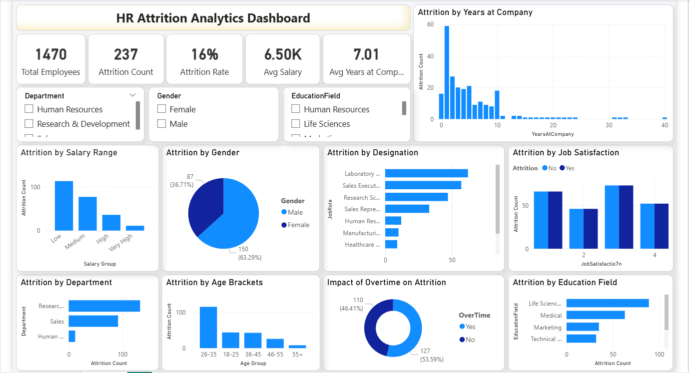

# HR Attrition Analytics Dashboard

## 📊 Project Overview
This repository features an enterprise-grade **HR Attrition Analytics Dashboard** created using Power BI. The project uncovers critical workforce insights by analyzing key retention metrics, employee satisfaction levels, and workload factors to help HR leaders design proactive talent retention frameworks.

---

## 📷 Dashboard Preview

---

## 💡 Executive Insights & Workforce KPIs
With a total workforce context of **1,470 Employees**, the organization records an **Attrition Count of 237**, resulting in a baseline **16% Attrition Rate** with an **Average Salary of $6.50K** and an **Average Tenure of 7.01 Years**.

### 🔍 Key Strategic Discoveries:
* **Overtime & Burnout Risk:** A stark contrast is visible where **46.41% (110 employees)** of total attrition is driven by individuals working overtime, highlighting burnout as a primary attrition catalyst.
* **Age Demographics:** The **26-35 age bracket** exhibits the highest vulnerability to attrition, identifying early-to-mid career professionals as a high-risk talent segment.
* **Compensation Analysis:** Attrition volume is heavily skewed toward the **Low Salary Group**, proving that salary benchmarking plays a major role in workforce stability.
* **Tenure Metrics:** The 'Years at Company' distribution reveals a significant attrition spike within the **first 1 to 2 years** of onboarding, indicating an immediate need for better employee engagement programs during early tenure.

---

## 🛠️ Tools & Technologies Used
* **BI Architecture:** Power BI Desktop
* **Data Processing & ETL:** Power Query Editor for HR metric alignment
* **Analytical Views:** Funnel distribution for designations, Overtime Donut trends, and Job Satisfaction matrices
